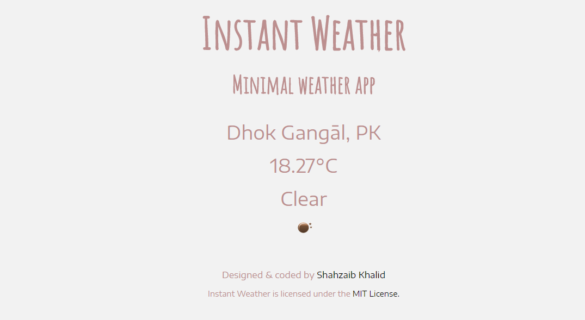
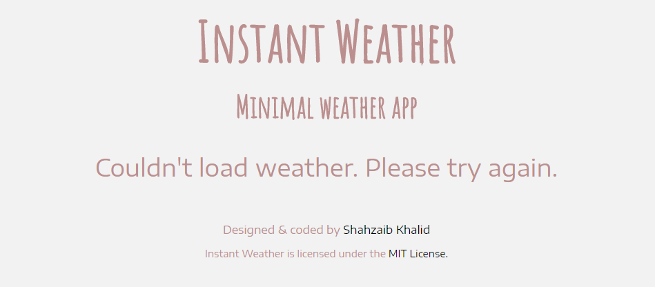

<h1 align="center">Instant Weather</h1>
<h3 align="center">Your Local Weather, A Single Click Away</h3>

An insanely simple, local weather and location finder, built using HTML, CSS &amp; JavaScript.

## Detail
Instant Weather provides a single click solution to find your current weather and location. No need of typing your city's name on your favorite search engine to find weather detail. Just open Instant Weather and allows the website to collect your location data and you'll know all about your current weather situation, without unnecessary details.

## Design
This is how Instant Weather looks like:

## Use
You can use Instant Weather by clicking [here](https://shahzaibkhalid.github.io/instant-weather/)

## License
Instant Weather is licensed under the [MIT License](https://github.com/shahzaibkhalid/instant-weather/blob/master/LICENSE.txt).

Copyright (c) 2017 Shahzaib Khalid
